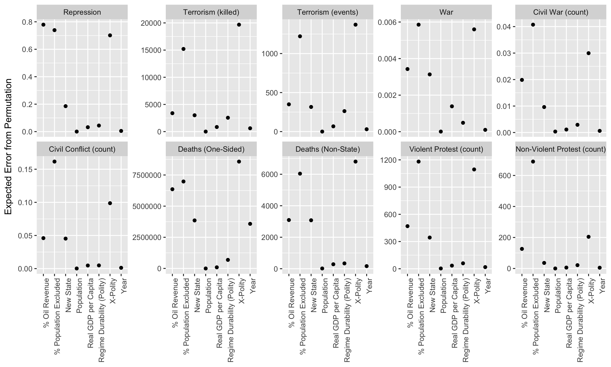

% Interpretable Statistical Learning Methods
% Zachary M. Jones[^contact]

[^contact]: Email: [zmj@zmjones.com](mailto:zmj@zmjones.com).

\begin{abstract}

Statistical learning methods, which are a flexible class of methods capable of estimating complex data generating functions, offer an attractive alternative to conventional methods, which often rely on strong, frequently inappropriate, assumptions about the functional form of the data generating process. A key impediment to the use of statistical learning methods is that they often output a "black box" which makes predictions but cannot be directly interpreted. I show that this need not be the case by describing and implementing simple methods based on Monte-Carlo integration that are capable of making any method that generates predictions interpretable. This allows researchers to learn about relationships in the data without having to prespecify their functional form. I illustrate this approach using a simulated example and an application to the study of political violence.
\end{abstract}

## Introduction
 
The social world is often complex, messy, and difficult to describe with a simple set of rules or laws. In contrast, conventional statistical methods *presume* data are generated by relatively simple processes [@king1989unifying; @berk2008statistical]. This hampers our ability to discover relationships in our data that we did not expect and reduces the predictive validity of our models [@miller2009complex; @beck2000improving; @beck1998beyond; @schrodt2014seven; @fariss_jones_2017; @berk2004regression]. Conventional statistical methods the data cannot tell us directly about relationships which were not prespecified in the model. Furthermore, the manner in which the data can inform our understanding of relationships which *were* prespecified in the model is constrained by the frequently strong assumptions made about their functional form in the course of specifying the model, e.g., it is difficult to learn about nonlinear and interactive relationships from a linear additive model. A key benefit of making strong functional form assumptions is that models can be made to be directly interpretable, by, e.g., assuming linearity, simple forms of nonlinearity (e.g., polynomial terms), and/or the absence of interactions involving more than, say, two variables.[^interpretability]. This comes at a substantial price, however. Conventional methods can miss interesting structure in data when that structure cannot be captured by the assumed model, which makes it difficult to improve our understanding and degrades the quality of our predictions.

[^interpretability]: Interpretability can be thought of in a number of ways (See, e.g., @interpretability), but here I use to to mean models which have additive components which can be visualized, e.g., for continuous inputs, functions of two or fewer covariates.

Advances in computing have allowed the development of statistical learning methods which allow us to make fewer assumptions about the structure in our data and consequentially to discover unexpected relationships in our data [@friedman2001elements]. Statistical learning methods differ from conventional statistical methods in that the number of parameters estimated is a function of the data, rather than specified by the researcher. This gives statistical learning methods the ability to find relationships in data that were not prespecified. This ability to find the unexpected, however, frequently makes the outputs from these methods uninterpretable, which, I argue, has prevented their wide use in political science, where the focus is on substantive insights in addition to prediction [@fariss_jones_2017; @ward2010perils; @hill2014empirical]. This is not generally a problem with conventional statistical methods because we *assume* that the function that generated the data has a relatively simple functional form which is usually easily interpretable.

I describe and implement general tools which can make **any** statistical learning or conventional method interpretable in ways that allow political scientists to answer questions about the importance of covariates, the nature of their estimated relationship with an outcome, and the presence of interactions amongst said covariates (and their shape) [@friedman2001greedy; @friedman2008predictive; @hooker2004discovering; @goldstein2015peeking]. These tools can also be used with conventional methods and I have made them available in an accessible manner via three `R` packages: the **M**achine **L**earning in **R** (`mlr`) package, which also provides infrastructure for fitting, tuning, and evaluating a wide variety statistical learning methods, the **E**xploratory **D**ata **A**nalysis using **R**andom **F**orests (`edarf`) package, which also contains interpretation methods specific to random forests, a particularly attractive statistical learning method for political scientists, and **M**onte-**C**arlo **M**ethods for **P**rediction **F**unctions (`mmpf`) which allows prediction functions to be marginalized to depend on a subset of the covariates [@edarf; @mlr; @mmpf].

The reason that statistical learning methods do not generally give interpretable outputs is that the manner in which they estimate a model, which is necessitated by their ability to learn complex relationships which were not presupposed, results in an output that, even if the true data generating process or true model *is* human interpretable, would hide that fact: a "black box." I will use the following illustrative example

$$f(v, w, x, z) = x + v^2 + xw + \sin(z)$$ {#eq:dgp}
$$y = f + \epsilon$$

where $w$, $v$, and $z$ are covariates uniformly distributed between $-2$ and $2$, $x$ is a covariate equal to $-1, 0, 1$ with equal probability, and $\epsilon$ is drawn from a standard normal distribution. Implicitly the $\beta$ for each of the additive components is 1.

To illustrate how statistical learning methods generate predictions that are often more accurate than conventional statistical methods without functional form assumptions, but at the cost of interpretability, consider a a regression tree [@breiman1984classification]. The way a regression tree estimates a model (i.e., how it arrives at predictions), is by subsetting (i.e., partitioning or grouping) $y$ using the covariates repeatedly so that the variability of $y$ within these subsets is minimized. This amounts to finding groups of observations wherein similarities amongst the covariates also reflect similarities in the outcome, which is precisely the same task that conventional regression methods like OLS solve. The result of this partitioning process is a nested set of subsets, a hierarchical structure (a tree): which can be thought of as rules (defined in terms of the covariates, e.g., if $x > 0$) which describe the final subset an observation ends up in. As can be seen in [@fig:tree] this output is substantially more difficult to interpret than a simple linear model. This problem is exacerbated when the estimated tree is larger (more complex), or when it is combined with other trees as in ensemble methods like boosted trees or random forests, which are generally preferable for reasons described in later sections. While [@eq:dgp] *could* be estimated with conventional methods, it would require the inclusion of the product of $x$ and $w$, a third degree polynomial expansion of $z$ to approximate the sine function between $-2$ and $2$, a squared term to estimate the effect of $v$ and a separate term to estimate the linear effect of $x$.[^specification] Statistical learning methods can estimate this data generating function without prespecification given enough data, and the interpretation methods I will describe herein can extract terms which represent each of the additive componets of [@eq:dgp].

[^specification]: This point is argued by @de2004untangling in response to @beck2000improving.

![A model estimated via a regression tree from 5000 samples from the data generating function [@eq:dgp]. Each circle indicates a subset or partition defined on the labeled covariate, with the rule for creating the subset listed on the line below the circle. The final subsets, or terminal nodes, shown in grey, give them predictions of the tree, the number of observations that fall into that subset, and the mean square error of the prediction on those observations. This tree was constrained to be simple for this visualization. \label{fig:tree}](figures/tree.png)

While there have been some applications of statistical learning in political science, their use has been largely limited to instances in which forecasting (e.g., @goldstone2010global) is the primary goal, with a few notable exceptions [@beck2000improving; @hainmueller2013kernel; @hill2014empirical; @LupuJones]. The set of potential applications is, I argue, much broader. While the feed-forward artificial neural networks and kernel regularized least squares used in @beck2000improving and @hainmueller2013kernel respectively are powerful methods which could be appropriately applied to many problems, they are not appropriate for *every* application, and thus it is desirable to be able to use, and interpret, the results of the best method available for a given problem. The methods described herein do precisely that, and, additionally, can be used with any conventional method. As previously mentioned I will illustrate these methods using data simulated from [@eq:dgp] as well as an example taken from the political violence literature. In both cases I use random forests, as implemented by @wright2015ranger.

Before proceeding to the details of these methods for making statistical learning methods interpretable, I will review why statistical learning methods can outperform conventional methods, why this makes their output uninterpretable, and how they can be viewed in the same statistical framework.

## Statistical Learning

Statistical learning methods like artificial neural networks, decision trees, random forests, boosting, and others have seen use in political science, but are far from common [@beck2000improving; @grimmer2013text; @hill2014empirical; @montgomery2015informed; @green2012modeling; @montgomery2015tree; @hainmueller2013kernel]. Statistical learning methods can be represented in the same framework as more conventional statistical methods. Here I review these equivalences and highlight both the difficulties and advantages of using statistical learning methods as compared to conventional methods.

Assume that the $(\mathbf{X}, Y)$ are random variables drawn from some probability distribution $\mathbb{P}$ over the sample space $\mathcal{X} \times \mathcal{Y}$, which represents all combinations of $\mathbf{X}$ and $Y$ that could be obtained, wherein $Y$ represents an outcome and $\mathbf{X}$ covariates.

We typically estimate the function which maps $\mathbf{X}$ to $Y$ by using sample data presumed drawn from $\mathbb{P}$. Usually we are interested in the conditional expectation of $Y| \mathbf{X}$ and we assume that this function depends on some parameters $\mathbf{\beta}$.

$$\mathbb{E} \left[Y | \mathbf{X} = \mathbf{x} \right] = f(\mathbf{x}, \mathbf{\beta})$$

Samples of $Y$ are denoted $\mathbf{y}$ and of $\mathbf{X}$, $\mathbf{x}$. To estimate $f$ we need to define a set of functions which can be searched for the best approximation to $f$, e.g., for a linear regression model the space of all possible values of the regression coefficients for the covariates included. We also need a way to decide which values of these parameters are "best." Finally, for computational reasons, we need a way to efficiently search through the set of possible models.

### Defining the Space of Possible Models

A *hypothesis space*, denoted $\mathcal{H}$, is a class which defines all possible functions that could be used to approximate the true data generating function $f$. In the case of a linear regression the hypothesis space is the set of functions which are linear and additive in the parameters. Specifically, for a two parameter simple linear regression of the form $y_i = \beta_0 + \beta_1 x_i + \epsilon$, the hypothesis space contains all the models where $\beta_0$ and $\beta_1$ are each real numbers between negative and positive infinity. So $\mathcal{H}$ contains an infinite number of models. We can estimate an $f$ with nonlinear relationships between $\mathbf{X}$ and $Y$ if we expand the basis of $\mathbf{X}$ by, for example, including polynomials of $\mathbf{x}$, but this must be specified in advance rather than being automatically learned from the data. In the case of this two parameter linear model the dimension of the space of possible parameters is fixed at two even though $\mathcal{H}$ contains an uncountably infinite number of models.

$$h(\mathbf{x}, \mathbf{\beta}) = \mathbf{\beta}^T \mathbf{x}$$ {#eq:lm}

Here each $h \in \mathcal{H}$, that is, [@eq:lm], is one of the possible models contained in the hypothesis space $\mathcal{H}$. Estimating, or learning, a model from data is searching over the hypothesis space to find the "best" candidate model.

In contrast to conventional methods like linear regression, statistical learning methods like boosting, trees, random forests, and artificial neural networks allow the number and value of parameters to be determined by the data. For example a regression tree, as in [@fig:tree] can be written as

$$h(\mathbf{x}) = \sum_{m=1}^M w_m \mathbb{I}(\mathbf{x} \in R_m)$$ {#eq:tree}

where $\mathbb{I}(\cdot)$ is the indicator function which equals 1 if $\mathbf{x} \in R_m$ and 0 if not, $R_m$ is the $m$'th  of the final, disjoint (non-overlapping), and exhaustive (all possible data points end up in a partition) partitions of the data (the terminal nodes as in [@fig:tree]), and $w_m$ is the mean value of $\mathbf{y}$ in this region. Each region $R_m$ is defined by which covariates, and which values in those covariates, were used to create the final set of partitions in the tree: so their number is data-dependent, generally growing with the size and complexity of the sample data. Other statistical learning methods work in a similar fashion: increasing their complexity as needed to best estimate $f$.

### Evaluating Candidate Models

How can we evaluate different candidate models in the hypothesis space? A loss function in this context $\mathcal{L}$ describes how good a particular $h$ is at predicting $\mathbf{y}$; in particular, how much different sorts of errors "cost" in some sense. Specifically, the loss $\mathcal{L}$ here is a function which maps predictions made by an approximation to $f$, that is, a member of $\mathcal{H}$, which we've called $h$ but when estimated from the data is conventionally referred to as $\hat{f}$, and observed realizations of $Y$, $\mathbf{y}$, to a positive real number. Herein lies a problem though, as we are trying to approximate $f$, not perfectly reconstruct $\mathbf{y}$. $Y$ is assumed herein to be random, and so is presumed to contain a random and a systematic component, i.e., $\mathbf{y} = f(\mathbf{x}) + \epsilon$, as in [@eq:dgp]. If we could compute the discrepancy between $\hat{f}$ and $f$ rather than $\hat{f}$ and $\mathbf{y}$ we would be able to distinguish between candidate hypotheses $h$ which have over-adapated to the sample data $\mathbf{y}$ (i.e. begun to represent noise), and those that have more accurately estimated $f$ and hence will generalize better to new data (since $\epsilon$ will make any new data drawn from $Y$ different than the sample data $\mathbf{y}$). However, since we do not know $f$ we have to use $\mathbf{y}$, which conflates systematic error, when the function estimated from the sample data, called $\hat{f}$, imperfectly represents $f$, and error due to the irreducible randomness in $Y$. As a result minimizing the sample-average loss on the observed data may result in selecting models $\hat{f}$ which are close approximations of $\mathbf{y}$ but poor (relative to other possible choices) representations of $f$: over-fitting. This is the opposite of the problem of picking a method where the best model $\hat{f}$ in the hypothesis space is far from $f$: under-fitting. Under **or** over-fitting leave us with models which can be rather useless in learning about $f$, that is, they may constitute poor explanations for how covariates are related to the outcome. As a result the quality of predictions will also suffer. This problem is illustrated graphically in @fig:error.

In the case of under-fitting the necessary solution is clear: chose a method with a hypothesis space $\mathcal{H}$ which either contains $f$ or where the distance between the edge of $\mathcal{H}$ and $f$ is small. Since $f$ is unknown, the practical implication of this is that avoiding under-fitting often necessitates the use of methods which have large hypothesis spaces: statistical learning methods, unless other information provides reliable information about the properties of $f$. Although theory certainly can and should serve this purpose as well, the evaluation of theory must necessarily allow for the possibility that it is wrong: giving us an opportunity for its improvement.

Like in the case of under-fitting, there are ways to avoid over-fitting such as minimizing the expected loss over the distribution of $Y, \mathbf{X}$: $\mathbb{P}$. The expected loss is usually called the risk, and minimizing it can eliminate optimism that comes from over-fitting the sample data. However, since $\mathbb{P}$ is unknown this is also not directly possible. While the sample-average loss is an estimator of the risk, it is generally biased downwards, that is, it is optimistic (i.e., it indicates the model fits better than it actually does), when applied to the same data on which the model was estimated [@friedman2001elements]. A common solution to this issue is to estimate the risk by using Monte-Carlo methods like cross-validation or the bootstrap which randomly shuffle the data to make it more difficult for over-fit models to appear better performing than they truly are at making accurate predictions beyond the sample data [@friedman2001elements].[^structural] Penalized regression models like the least absolute shrinkage and selection operator (LASSO) or ridge regression make use of this idea to shrink the regression coefficients of a linear model (sometimes to 0), making it simpler, to avoid over-fitting.[^smoothing] Statistical learning methods use this idea to make the model as simple or complex as is necessary to minimize risk.

[^structural]: It is also sometimes possible to derive an upper bound on the risk given the "size" (e.g., the cardinality or the complexity) of $\mathcal{H}$, the amount of data available, and the sample average loss [@vapnik1994measuring; @vapnik1998statistical].
[^smoothing]: Another way of saying this is that regularization or shrinkage makes the model less sensitive to the sample data or that it makes the model smoother.

Choosing a loss function is an application specific task that depends on the costs of making different sorts of prediction errors. With a binary outcome, it might be the case that positive cases are more costly when they are not predicted than are negative cases that are not predicted, or, with a continuous outcome, over-prediction might be more costly than under-prediction [@berk2009forecasting; @muchlinski2016comparing]. For example mispredicting cases where persons convicted of violent crimes reoffend after parole might be more costly than predicting recitivism amongst those convicted of non-violent crimes, and it is possible that in some cases over-predicting recitivism is less consequential than under-predicting it [@berk2009forecasting]. While squared-loss or misclassification-loss is often used because it makes the third step, the search or optimization strategy, easier, it is not necessarily the most appropriate choice, and what loss function is used has an enormous impact on what function from the hypothesis space is chosen as the best approximation to $f$ since it is *the* criteria for that choice.

### Searching for the Best Model

In many cases, even for a simple linear regression, the hypothesis space contains an infinite number of models, and so it is impossible to evaluate every possiblity. A way to efficiently search through the hypothesis space must be devised. In some cases this can be done with relative ease but for many hypothesis spaces even the best available optimization methods cannot guarantee that they will find the best approximation to the true function because of the shape of the loss function over the hypothesis space (i.e., due to non-convexity). While a hypothesis space which is easy to search over might be attractive, if the best candidate in said hypothesis space is far from the truth: $f$, this can be of little importance, since the error in representing $f$ with $\hat{f}$ is large. It may be the case that a candidate model taken from a larger hypothesis space, even if it is not guaranteed to be the best model in that space, is much closer to $f$. This is illustrated graphically in [@fig:error] and discussed in more detail in @fariss_jones_2017.

![Here the circle represents the hypothesis space $\mathcal{H}$, $f$ is the true model, which in this case is not contained in the hypothesis space. $h^*$ is the point (the model) in the hypothesis space closest to $f$, i.e., what could be achieved with an infinite amount of data. The difference between this point and the true model is approximation error that is due to restricting the hypothesis space to $\mathcal{H}$. Decreasing the "size" of $\mathcal{H}$ increases approximation error, but decreases estimation error, which is error that comes from having to search $\mathcal{H}$ for the best model: $h^*$, which generally becomes more difficult as $\mathcal{H}$ grows. I am arguing herein that because $f$ is likely very complex in many social systems, approximation error is substantially larger than estimation error. \label{fig:error}](figures/error.png)

For illustrative purposes consider a linear additive model as in [@eq:lm] with a squared loss function (i.e. ordinary least squares). Then the loss function we want to minimize is the sum of the squared differences between the predictions $\hat{f}$ and $\mathbf{y}$. There exists a unique closed-form solution to the problem of estimating the parameters of $\hat{f}$ (i.e., the normal equations), and variation in what method is used to solve these equations depends primarily on those methods' numerical properties.

<!-- In this simple case gradient descent suffices to find the parameters which minimize the loss function. -->

<!-- $$h(\mathbf{\beta}, \mathbf{x}) = \sum_j \beta_j x_j$$ -->
<!-- $$\mathcal{L}(\mathbf{y}, h) = \sum_{i = 1}^N \frac{1}{2}(y_i - h)^2$$ -->
<!-- $$\nabla \mathcal{L} = \frac{\partial \mathcal{L}}{\partial \mathbf{\beta}} = \frac{1}{N} \sum_{i = 1}^N - x_i(y_i - h)$$ -->

<!-- Since the gradient $\nabla \mathcal{L}$ gives the direction in which the loss function is changing as a function of $\mathbf{\beta}$, iteratively picking candidate values of $\mathbf{\beta}$ based on the negative of the gradient converges to the set of values for $\beta$ which minimize $\mathcal{L}$. From a starting value $\mathbf{\beta}^0$ the sequential update for the next step is -->

<!-- $$\mathbf{\beta}^{(k + 1)} = \mathbf{\beta}^{(k)}  - \gamma_k \nabla \mathcal{L}(\mathbf{\beta}^{(k)})$$ -->

<!-- where $\gamma$ controls the size of the steps along the gradient, which can itself be estimated by gradient descent. The procedure stops when $\nabla \mathcal{L}$ is sufficiently small, that is, when the loss function is no longer decreasing. -->

In contrast consider a regression tree, which is often a component of other statistical learning methods such as random forests or gradient boosting. Like with the aforementioned linear additive model we want to minimize the loss $\mathcal{L}(\mathbf{y}, h) = \frac{1}{2} \sum_{i = 1}^N (y_i - h)^2$, however now the number of parameters is itself unknown. In [@fig:tree] the rule which defines each node in the tree is a parameter (a cut-point in a particular covariate) and the number of these parameters which will determine the output model is not fixed upfront and instead is controlled via hyper-parameters, in the case of regression trees a common hyper-parameter used to keep trees from over-adapting to the sample/training data is requiring that all partitions have some minimum number of observations. Due to the near unbounded potential complexity of a tree model it isn't possible to find with certainty the best possible tree model: the hypothesis space is both large and poorly behaved in the sense that it is neither continuous nor convex. Hence locally optimal (greedy) methods are used to fit a tree: at each point in the process of estimating the cut points the split (an observed value of one of the covariates) which decreases the loss the most within that partition is the one that is chosen.

<!-- In contrast consider gradient boosting, a statistical learning method. Like with the aforementioned linear additive model we want to minimize the loss $\mathcal{L}(\mathbf{y}, h) = \frac{1}{2} \sum_{i = 1}^N (y_i - h)^2$, however now each candidate $h$ has more parameters. $h$ must be estimated sequentially and is composed of a sequence of models which are combined in the last step. We denote the first $m$ components of $h$ as $h_m$. -->

<!-- $$h_m(\mathbf{\gamma}, \mathbf{\theta}, \mathbf{x}) = \sum_{m = 1}^M \gamma_m \phi_m(\mathbf{x}, \mathbf{\theta}_m)$$ {#eq:boost} -->

<!-- Here $\phi_m$ is a model itself, such as a regression tree like is shown in [@fig:tree]. For each $m$ the gradient of $\mathcal{L}$ with respect to $h_m$ is -->

<!-- $$\nabla \mathcal{L}(h_m) = \frac{\partial \mathcal{L}}{\partial h_m} = \sum_{i = 1}^N (y_i - h_{m})$$ -->

<!-- and so, like in the case of gradient descent for linear regression -->

<!-- $$h_{m + 1} = h_m - \gamma_m \nabla \mathcal{L}(h_m)$$. -->

<!-- The scaling parameters $\mathbf{\gamma}$ are estimated by a separate application of gradient descent.[^gamma] -->

<!-- [^gamma]: Specifically, $\gamma_m = \arg\min_{\gamma} \mathcal{L}(\mathbf{y}, h_{m - 1} + \gamma h_m)$. -->

<!-- So at each step $m$ boosting using this loss function amounts to fitting $\phi_m(\mathbf{x}, \mathbf{\theta}_m)$ to $\mathbf{y} - h_{m - 1}$: repeatedly refitting the residuals. This amounts to giving higher weight to observations where the sequence of models thus far has performed poorly, and by combining these models as in @eq:boost nonlinear relationships between $\mathbf{x}$ and $\mathbf{y}$ can be estimated without specifying $\phi$s which can estimate nonlinearity (e.g., each could be a linear model, or, more commonly, a regression tree with only one split). It should also be clear that the resulting output $h_M$, which is a weighted sum of models $\phi_m$, which are themselves estimated on residuals which depend on $h_{m-1}$ is not directly interpretable, even if the data generating function it is approximating is. This property is a consequence of statistical learning methods' capacity for automatically finding patterns (e.g., nonlinearity and/or interaction amongst the covariates) that were not prespecified. -->

## Interpreting Models

I argue that there are four main types of model interpretation which are commonly sought. Functional form describes the shape of the relationship between covariates and the model. Magnitude describes how important covariates are in determining the model's predictions. Interaction detection relates to the estimation of the functional form and magnitude of the relationship between groups of covariates and the model. Reliability relates to how different sources of variability could possibly change the quantities above.

### Functional Form

Interpreting the functional form of the relationship between the covariates and the model is one of the most common tasks. For many conventional methods like linear models this is often described by a single number which is obtained by taking the partial derivative of the model with respect to said covariate; e.g., for a linear and additive model $\frac{\partial \hat{f}}{\partial \mathbf{x_j}} \sum_j \beta_j \mathbf{x}_j = \beta_j$. For models which are nonlinear in $\mathbf{x}_j$ this derivative is non-constant but does not necessarily depend on $\mathbf{x}_{-j}$. For example if $\hat{f} = \beta_1 \mathbf{x}_1 + \beta_2 \mathbf{x}_1^2 + \beta_3 \mathbf{x}_2$ then $\frac{\partial \hat{f}}{\partial \mathbf{x}_1} = \beta_1 + \beta_2 \mathbf{x}_1$ and to interpret the relationship between $\mathbf{x}_1$ and $\hat{f}$ it is necessary to plot $\mathbf{x}_1$ and this derivative at a grid of values on $\mathbf{x}_1$. In cases where the partial derivative with respect to $\mathbf{x}_j$ depends on $\mathbf{x}_{-j}$ values of $\mathbf{x}_j$ must be chosen as well, even when there is no interaction, as might be the case in a model like logistic regression. With statistical learning methods the estimated function $\hat{f}$ is often a "black box" and so it is not known, necessarily, after estimating a model, whether there are interactions or nonlinearities that have been estimated, and hence any understanding of the relationshp between $\mathbf{x}_j$ and $\hat{f}$ depends on the values of $\mathbf{x}_j$ and $\mathbf{x}_{-j}$ chosen to evaluate $\hat{f}$ at.

### Magnitude

Magnitude describes how important covariates are in determining a models' predictions. One way to measure importance in the case of a linear model is via the absolute size of the associated regression coefficients. For a nonlinear model this isn't so simple. If the derivative of the model with respect to a covariate is non-constant then there is no longer a single number summary of that covariate's influence on the model's predictions. Yet, this might be what is desired, as in @hill2014empirical where the goal was to rank a large set of potentially relevant covariates in order to focus on ones that were identified as useful predictors by the model. With a discontinuous model (e.g., a tree-based model) derivatives may not be available at all.

### Interaction Detection

The identification and description of interactions is another common interpretative task [@brambor2006understanding]. In the case of a linear model, again, this is fairly straightforward, though the product terms commonly used to estimate interactions in these models are commonly misused in testing nonlinear hypotheses [@hainmueller2016much; @pepinsky2017visual]. Using statistical learning methods avoids this problem by automatically detecting interactions while making few assumptions about their functional form. This allows researchers to ask these common questions, such as, how the effect of one covariate on $\hat{f}$ changes as a function of another. Interaction detection can be cast as the functional form of the joint effect of covariates or their joint importance.

### Reliability

Most of the above, when computed using conventional methods, are or can be accompanied by estimates of reliability designed to quantify variability from sampling from the data generating process (e.g., standard errors). In some cases this can be a useful measure of reliability. In those cases it is easy to incorporate these estimates of sampling variability into the aforementioned quantities. However, in many cases the assumptions necessary for these reliability estimates to be valid are violated. This is particularly problematic in social data, where dependence amongst observations is both complex and ubiquitous, so much so that it is often of primary interest, as it is in analyses of social networks. It may also be the case that uncertainty from non-random measurement error is substantially more important than random measurement error (i.e., sampling error) in many cases, and instances where non-random measurement error is identified or where multiple measures of the same (or similar) concepts produce substantially different conclusions constitute anecdotal evidence that this is the case [e.g., @LupuJones; @baum2015filtering; @jerven2013poor; @hegre2006sensitivity]. A particular example of this is considered herein. The Polity IV regime type measurement is ubiquitous in comparative politics and international relations where it is treated as an ordered variable with regime interruptions, interregum, and transitions treated as "missing." These "missing" categories are predictive of a number of forms of political violence, which suggests that, at least in this case, many measures of uncertainty might not be as trustworthy as their theoretical best-case properties suggest. Thus I have not focused on discussing reliability measures here. Nonetheless, all of the software referenced herein is capable of using estimates of the variability of a models' predictions to produce reliability bounds for the aforementioned types of interpretation tasks which correspond to the quantities that typically accompany the equivalent outputs from conventional methods.[^variance]

[^variance]: See, e.g., @sexton2009standard or @wager2014confidence for examples of methods for estimating the variance of predictions from random forests.

## Political Violence

To illustrate the usefulness of interpretable statistical learning methods I consider the literature on political violence and regime type. It is common in this literature to make strong assumptions about the functional form of the relationship between said regime types or features and political violence, and, as @LupuJones show, this makes detecting deviations from the form assumed by the researchers when specifying their models difficult. @LupuJones, who criticize the literature for this reason, assume that the Polity IV (or rather, the X-Polity scale of @vreeland2008effect) is fully ordered, which requires treating periods of interruption, interregnum, and transitions as "missing" and interchangeable when that is not the case given the aforementioned codings [@PolityIV]. Rather, it seems likely that states coded as going through interruption, interregnum, and transitions will display substantial variability in how much and what types of political violence is measured, perhaps dwarfing variability across the democracy-autocracy scale. Models used in this literature as a rule do not consider the possibility that regime type and other covariates, e.g., measures of the economy like GDP, have strong interactions, despite their being an entire subfield (political economy) devoted to the study of the relationship between the two. Taking the data from @LupuJones I use a random forest to estimate the functional form and magnitude of the relationships between an unordered version of X-Polity which includes these codings as categories and several other structural covariates. I describe the results of this analysis as I explain the details of the methods that generate them.

## Approximating and Interpreting Functional Form

When the most complex functional form capable of learned from the data is simple, as in a linear additive model, the parameters of said model are often directly interpretable, which, to reiterate, is a consequence of **assumed** simplicity, which may or may not be appropriate in a given circumstance. Some statistical learning methods have similar properties [See, e.g., @hainmueller2013kernel; @beck2000improving]. However, many such methods cannot be directly interpreted but may be otherwise desirable for a given application: due to, e.g., their ability to deal with a large number of samples and/or many covariates, their predictive performance in this or similar applications, etc. One attractive method is the random forest, which is used here to model data from [@eq:dgp] and to predict levels of political violence given a set of structural covariates that measure features of countries over time [@breiman2001random; @wright2015ranger; @LupuJones]. 

One of the most common types of interpretation for conventional methods is functional form; i.e., for a linear model the sign and magnitude of the coefficient for a covariate, defining the slope of the line representing its relationship with the model's predictions. For conventional models where one or more of the covariates have a nonlinear relationship in the model, e.g., a logistic regression, the effect of a covariate on the model's predictions depends on the other covariates. To understand the effect of a covariate then, it is necessary to compute predictions at particular values of the other covariates. Choosing sample average values for these covariates is common practice, but with models which may have estimated interactions between the covariates, where the empirical distribution of the covariates is not unimodal, or when the distribution of the covariates is dependent, this approach makes it difficult to detect such interaction and may distort the marginal relationships as well [@hooker2007generalized]. Further analysis of these problems are beyond the scope of this paper, but are elaborated in @mmpf. One alternative is to compute an average marginal effect, which gives the effect of a particular covariate computed at, rather than fixed values for the other covariates, every observed combination of the other covariates (or a subsample thereof for computational reasons). This is a form of Monte-Carlo integration which also works with statistical learning methods, where it is referred to as partial dependence. It allows the recovery of the partial relationship between particular covariates and $\hat{f}$ regardless of how $\hat{f}$ is estimated [@friedman2001greedy].

### Partial Dependence

![This figure shows the partial dependence: the marginalized prediction function, for each term in [@eq:dgp], constructed from a random forest fit to 5,000 samples and the data generating function if it were known estimated exactly, but was still a "black box"" (a "noiseless" estimate of [@eq:dgp]). In the top left panel is the partial dependence of the discrete covariate $\mathbf{x}$, and in the bottom left its interaction with the continuous covariate $\mathbf{w}$. In the upper and lower right panels the partial dependence of the covariates which have nonlinear effects, $\mathbf{v}$ and $\mathbf{w}$ are shown. While a conventional method like ordinary least squares could estimate [@eq:dgp], the random forest estimated these relationships without prespecification, and with partial dependence we are able to recover the functional form of these relationships accurately. \label{fig:pd}](figures/pd.png)

The *partial dependence* of $\hat{f}(\mathbf{x})$ on $\mathbf{x}_u$, given in [@eq:pd] can be estimated from the sample data regardless of how $\hat{f}$ was estimated [@friedman2001greedy @mmpf].

$$\mathbb{E}[f(\mathbf{x})] = \int_{\mathbf{x}_{-u}} f(\mathbf{x}) d\mathbb{P}(\mathbf{x}_{-u}) \approx \frac{1}{N} \sum_{i = 1}^N \hat{f}(\mathbf{x}_u, \mathbf{x}_{-u}^{(i)}) = \bar{f}_{\mathbf{x}_u}(\mathbf{x}_u)$$ {#eq:pd}

This gives the relationship between the prediction made by $\hat{f}(\mathbf{x})$ and $\mathbf{x}_u$ averaged across the observed values of $\mathbf{x}_{-u}$. A grid of points on $\mathbf{x}_u$ must still be chosen, and this can be obtained by sampling from the observed values $\mathbf{x}_u$, by selecting values of interest, or by creating a uniform sequence of values.

How closely $\bar{f}_{\mathbf{x}_u}(\mathbf{x}_u)$ corresponds to $\hat{f}(\mathbf{x}_u)$ depends on the structure of $\hat{f}$. In the case where $\hat{f}(\mathbf{x})$ is additive or multiplicative in $\{\mathbf{x}_u, \mathbf{x}_{-u}\}$, that is, $\hat{f}(\mathbf{x}) = \bar{f}_{\mathbf{x}_u}(\mathbf{x}_u) + \bar{f}_{\mathbf{x}_{-u}}(\mathbf{x}_{-u})$ or $\hat{f}(\mathbf{x}) = \bar{f}_{\mathbf{x}_u}(\mathbf{x}_u)\bar{f}_{\mathbf{x}_{-u}}(\mathbf{x}_{-u})$ computing the partial dependence gives an approximation to $\hat{f}(\mathbf{x}_u)$ that is accurate to an additive or multiplicative constant, respectively [@friedman2001greedy, @mmpf]. Discovering when such (additive or multiplicative) factorizable structure is *not* present is a question about interaction, that is, non-separable dependence between $\mathbf{x}_u$ and $\mathbf{x}_{-u}$ in $\hat{f}$.

@fig:pd and @fig:pd_mvpv show the results of applying this method. @fig:pd makes clear that in an idealized scenario which arguably has a meaningful correspondence with common problems in political science, the method can accurately recover the true relationships. @fig:pd_mvpv shows how this can be practically consequntial. In many cases the variability amongst the "missing" categories dwarfs that of the rest of the scale. @hill2014empirical pointed out that the "executive constraint" component of the Polity IV scale directly encodes types of political violence. This is arguably true for these categories as well. The operational definition of interruption is "if a country is occupied by foreign powers during war, terminating the old polity, then reestablishes a polity after foreign occupation ends" [@PolityIV]. Unsurprisingly when a state is occupied by a foreign power and is coded as -66 terrorism deaths and events, and violent and non-violent protest all are predicted to substantially increase. Interregnum (-77) which is coded as "[times] during which there is a complete collapse of central political authority. This is most likely to occur during periods of internal war" are unsurprisingly strongly predictive of one-sided and non-state deaths and the incidence of civil conflict or war. Transition periods (-88) which are defined as changes of more than three points in either the democracy or autocracy components in a single year have a somewhat less obvious relationship with political violence, but is still strongly associated with civil conflict/war.

Regime type clearly does not have an independent effect on political violence however, which is to say that it interacts with many other factors (including political violence!). One way of detecting interaction amongst the covariates using partial dependence is to estimate the point-wise variability of [@eq:pd], as shown in [@fig:int] and [@fig:pd_mvpv_var]. This can be done again using Monte-Carlo methods by substituting the sample variance for the mean, i.e., the variance of $\hat{f}$ for a fixed grid of values on $\mathbf{x}_u$ across the sample values of $\mathbf{x}_{-u}$ (or a subsample thereof). If there is interaction between $\mathbf{x}_u$ and $\mathbf{x}_{-u}$ which has been estimated in $\hat{f}$ the the partial dependence of $\mathbf{x}_{-u}$ will be non-constant, i.e., it will vary across the range of $\mathbf{x}_u$, and, its variability will in general increase as the strength of the interaction with $\mathbf{x}_{-u}$ increases, which can be seen in [@fig:int] with the two covariates $x$ and $w$ which interact in [@eq:dgp].[^ice]

[^ice]: Another possibility is to avoid Monte Carlo integration over the distribution of $\mathbf{x}_{-u}$ and to instead visualize the expected value of the outcome at $\mathbf{x}_u$ for each observation conditional on $\mathbf{x}_{-u}$. @goldstein2015peeking propose using this approach. `mmpf`, `edarf`, and `mlr` are capable of estimating this as well.

![The marginal variance of the covariates indicated in the top of each panel. The covariates which do not interact in [@eq:dgp] have a constant variance across their range, since in these cases changing the value of the indicated covariate does not modify the effects of any others: that is, there is no interaction, which the model has correctly estimated as can be seen in @fig:pd. In the case of both $\mathbf{w}$ and $\mathbf{x}$, which do interact, it is clear that the variance is non-constant, and that it increases when $x = -1$ or $x = 1$, which are the two areas in which $x$ interacts with $w$ (when $x = 0$ there is no effect). \label{fig:int}](figures/int.png)

![The marginal variance of the model's predictions show points in X-Polity where the model's predictions are variable, and thus depend on values of covariates other than X-Polity: regions of interaction. In a number of cases there appears to be substantial variability in the model's predictions during periods of interruption, interregum, or transition, and also in cases at the ends of the X-Polity scale: autocracies and democracies, suggesting that in those areas the model has found interactions. \label{fig:pd_mvpv_var}](figures/pd_mvpv_var.png)

@fig:int shows that in the simulated example this method can correctly identify regions of interaction. @fig:pd_mvpv_var applies this method to the political violence example. In the case of repression there appears to be stronger interaction between X-Polity and other covariates for highly democratic and highly autocratic states. In a number of other cases there appears to be interactions that were only detected within particular levels of X-Polity: interruption (-66) for terrorism deaths/events and violent/non-violent protest, interregnum (-77) for one-sided deaths, and some particular categories within the normal X-Polity scale.

<!-- Figure @fig:pd_mvpv_int_repression investigates variability in the joint relationship between X-Polity, repression, and real GDP per capita. The relationship between real GDP per capita and repression seems to be piece-wise linear where the slope and number of components (either two or three) varies according the X-Polity. For example states coded as highly democratic are also  -->

<!--  -->

[^partial]: The partial derivative of each summand in [@eq:pd] with respect to $\mathbf{x}_u$ can also be estimated using numerical methods and is implemented in @mlr. This serves as another way to discover interactions between $\mathbf{x}_u$ and $\mathbf{x}_{-u}$ [@goldstein2015peeking]. If there is interaction then the partial derivative will depend on both $\mathbf{x}_u$ and $\mathbf{x}_{-u}$, while if there is no interaction the derivative will not. Hence variation in the derivative of the individual conditional expectation indicates interaction. Numerical estimation of derivatives, however, can be computationally expensive.

All of the above can be quickly and easily estimated for any prediction function $\hat{f}$, regardless of how it was estimated (i.e., both conventional and statistical learning methods) from the sample data using **M**onte **C**arlo **M**arginalization of **P**rediction **F**unctions (`mmpf`) which is a publically available `R` package. The **M**achine **L**earning in **R** (`mlr`) package also makes all of this functionality available, and, additionally, makes available a wide variety of statistical learning methods available for use in a consistent manner, with a wide variety of tools for evaluating and tuning their performance [@mlr; @mmpf]. Lastly, **E**xploratory **D**ata **A**nalysis using **R**andom **F**orests (`edarf`) again provides similar functionality to what is described above along with additional interpretation methods specific to random forests, which are beyond the scope of this paper [@edarf].

## Variable Importance

![Permutation importance estimated from the data generating function in [@eq:dgp]. This indicates that the most important component of the model is the interaction of $\mathbf{x}$ and $\mathbf{w}$. Since $\mathbf{x}$ and $\mathbf{w}$ interact in [@eq:dgp] and the random forest estimated this interaction, as can be seen in [@fig:pd], permuting either or both covariates will increase prediction error substantially, as they introduce error from the individual components as well as their interaction. In this way permutation importance gives weight to covariates like $\mathbf{w}$ which may only have a conditional effect. Components with less variability, like $\sin(\mathbf{z})$ (which has a sample variance of $0.592$) have less importance than those with more variability (e.g., $\mathbf{v^2}$, which has a sample variance of $1.418$). \label{fig:pi}](figures/pi.png)

The question of whether covariates are important and to what degree is a question that commonly arises, especially with predictive and exploratory tasks. In case of the former it is often advantageous to remove covariates which are not useful in predicting the outcome and in the latter case computing the importance of covariates is useful in finding strong predictive relationships for further study [@shmueli2010explain]. For example these methods were used by @hill2014empirical to rank covariates according to their importance in predicting different measures of human rights abuses. As previously mentioned in the case where the derivative of the model with respect to a covariate is constant the importance of that covariate in that model can summarized by this single number, but with models where this derivative is non-constant there is no straightforward way to summarize the importance of a covariate with a single number. Fortunately, there are methods which have generalized the notion of importance to models of an arbitrary form.

Permutation importance is a general method for estimating variable importance which is agnostic to the method used to estimate $\hat{f}$. Specifically, it is the expected change in prediction error that occurs when $\mathbf{x}_u$ is permuted. If $\mathbf{x}_u$ was not useful to $\hat{f}(\mathbf{x})$ in making predictions then we would expect no change or a decrease in prediction error, whereas if $\mathbf{x}_u$ is important there should be an increase in prediction error when it is permuted. Due to Monte-Carlo error from the permutation, this is repeated $M$ times to give the expectation of the change in the loss $\mathcal{L}$ from permuting $\mathbf{x}_u$.

$$I_{\mathbf{x}_u} = \frac{1}{M} \sum_{j = 1}^M \mathcal{L}\left(\hat{f}(\mathbf{x}_{u \pi^{(j)}}, \mathbf{x}_{-u}), \hat{f}(\mathbf{x})\right)$$ {#eq:pi}

Take for example a linear model of the form $\hat{f}(\mathbf{x}) = \beta_1 \mathbf{x}_1 + \beta_{2} \mathbf{x}_{2}$. Suppose that $\beta_{1}$ is $0$. Then if we randomly permuted $\mathbf{x}_{1}$ $M$ times, and, for each one of those times we computed $\hat{f}$ using this randomly shuffled version of $\mathbf{x}_{1}$, denoted $\mathbf{x_{1 \pi}}$ in [@eq:pi], we would find that the prediction error did not change at all, because $\mathbf{x}_{1}$ does not contribute to the prediction made by $\hat{f}(\mathbf{x})$. Conversely, if we permuted $\mathbf{x}_2$, and $\beta_2$ was non-zero, perhaps relatively large, we would be multiplying a randomly shuffled covariates by a large number $\beta_2$, and, unsurprisingly, this would make $\hat{f}$ also random, and consequently its predictions would degrade, which would allow us to conclude that $\mathbf{x}_2$ *is* important in determining $\hat{f}$, and that it is more important than $\mathbf{x}_1$. Clearly this is unecessary in this simple case where we could simply inspect the parameters $\beta_1$ and $\beta_2$, but with statistical learning methods this is not usually possible.

@fig:pi shows this method on the simulated example where it preserves the ordering of the magnitude of the coefficients used to generate the sample data. @fig:pi_mvpv shows the permutation importance of the covariates for different types of political violence (estimated from the same model used in earlier sections). Unsurprisingly X-Polity is a consistently important predictor of all the forms of political violence considered. Perhaps more surprising is the relative unimportance of real GDP per capita, which often features promiently in models of political violence.

Comparing the the change in the loss that results from permuting certain covariates to the loss without permuting any covariates can be done in many ways. With categorical (ordered or unordered) outcome variables category-specific or overall (e.g., average agreement across categories) comparisons can be made, which can be useful in cases where categories are imbalanced or the costs of making prediction errors differs across the categories, e.g., as may be the case when predicting violence, where an absence of violence is more common than violence but violence is often costly when not anticipated [@berk2009forecasting]. With a continuous outcome the permutation importance can be computed for the mean, i.e., how permuting a covariate affects the conditional expectation function, or any other summary of the distribution of outcomes, such as a quantile. Lastly the permutation importance may not be aggregated at all, giving an observation specific measure of importance. This can, for example, be used to estimate the importance of covariates across the distribution of the outcome (a continuous analogue to category-specific importance).

Permutation importance is not the only method for computing predictive importance with statistical learning methods. There are other generic methods beyond the scope of this paper, as well as method specific measures, such as for Random Forests [@strobl2007bias; @strobl2008conditional; @altmann2010permutation; @nicodemus2010behaviour; @janitza2013auc; @gromping2009variable; @louppe2013understanding; @friedman2001greedy]. Permutation importance as described above is implemented in `edarf`, `mmpf`, and `mlr`.

## Summary and Future Work

Future empirical work can make use of statistical learning methods which allow us to avoid making unwarranted assumptions and learn about unexpected interactions and nonlinearities. Statistical learning methods will generally estimate models that generalize to new data better and extract more information about the relationships between the covariates and outcomes than do conventional methods as commonly used. Additionally, using statistical learning methods in cases where many conventional models would have been fit and compared on the sample data can help reduce researcher degrees of freedom (i.e., arbitrary but consequential data analysis decisions) that can have substantial effects on conclusions [@gelman2013garden].

Statistical learning methods can be used on their own for data analysis and can also be used in conjunction with conventional methods [See, e.g., @muchlinski2016comparing]. For example partial dependence can be used to compare the output from, e.g., a random forest, and a model with a more restricted functional form, and the permutation importance of the covariates could be compared to the size of the coefficients from a conventional method (or their ranks). The expected prediction error could also be compared in this instance; if statistical learning methods do substantially better than conventional methods this would indicate that conventional methods under-fit the data, i.e., the models that they represent are under-theorized.

The methods for interpreting the "black box" functions which are commonly the output of statistical learning methods described herein have all relied on integration. Another class of interpretation methods relies on projecting the estimated function onto a more interpretable set of functions, which is the subject of ongoing research [@hooker2007generalized; @chastaing2015anova; @chastaing2015generalized].

## References
